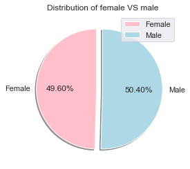

# Pharmaceutical Mice Tests and Analysis on Maplotlib/Python

What good is data without a good plot to tell the story?
Let's take Python with Matplotlib and apply it to a real-world situation and dataset:

## Background

Analysis on a burgeoning pharmaceutical company based out of San Diego. Pymaceuticals specializes in anti-cancer pharmaceuticals. In its most recent efforts, it began screening for potential treatments for squamous cell carcinoma (SCC), a commonly occurring form of skin cancer.

As a senior data analyst I've been given access to the complete data from their most recent animal study. In this study, 249 mice identified with SCC tumor growth were treated through a variety of drug regimens. Over the course of 45 days, tumor development was observed and measured. The purpose of this study was to compare the performance of Pymaceuticals' drug of interest, Capomulin, versus the other treatment regimens. You have been tasked by the executive team to generate all of the tables and figures needed for the technical report of the study. The executive team also has asked for a top-level summary of the study results.

## Steps

* Before beginning the analysis, check the data for any mouse ID with duplicate time points and remove any data associated with that mouse ID.

* Use the cleaned data for the remaining steps.

* Generate a summary statistics table consisting of the mean, median, variance, standard deviation, and SEM of the tumor volume for each drug regimen.

* Generate a bar plot using both Pandas's `DataFrame.plot()` and Matplotlib's `pyplot` that shows  the number of total mice for each treatment regimen throughout the course of the study.

  * **NOTE:** These plots should look identical.

* Generate a pie plot using both Pandas's `DataFrame.plot()` and Matplotlib's `pyplot` that shows the distribution of female or male mice in the study.

  * **NOTE:** These plots alomost look identical.

* Calculate the final tumor volume of each mouse across four of the most promising treatment regimens: Capomulin, Ramicane, Infubinol, and Ceftamin. Calculate the quartiles and IQR and quantitatively determine if there are any potential outliers across all four treatment regimens.

* Using Matplotlib, generate a box and whisker plot of the final tumor volume for all four treatment regimens and highlight any potential outliers in the plot by changing their color and style.

  **Hint**: All four box plots should be within the same figure. Use this [Matplotlib documentation page](https://matplotlib.org/gallery/pyplots/boxplot_demo_pyplot.html#sphx-glr-gallery-pyplots-boxplot-demo-pyplot-py) for help with changing the style of the outliers.

* Select a mouse that was treated with Capomulin and generate a line plot of time point versus tumor volume for that mouse.

* Generate a scatter plot of mouse weight versus average tumor volume for the Capomulin treatment regimen.

* Calculate the correlation coefficient and linear regression model between mouse weight and average tumor volume for the Capomulin treatment. Plot the linear regression model on top of the previous scatter plot.

**Note** See the [starter workbook](Pymaceuticals/pymaceuticals_starter.ipynb) for help on what modules to import and expected format of the notebook.

## Conclusions

1. Mouse ID g989 duplicates through the data frame when it was merge. After cleaning the data frame we can clearly observe in the bar chart that: the Drug regimen Propriva is affected on its Total number of Mice tested for the treatment , because meanwhile every Drug treatment has 25 mice tested in Total, the Total Number of Mice for Propriva has only 24 mice (1 Mouse ID less). Also it appears that female and male mice were carefully selected based on a delicate correlation of 50/50 , however when we take out the female mouse g989 the percentage drops to 49.60% female VS 50.40% male. Ultimately female participants had the last or greatest timepoint of recovery with the max of 45 days taken (all 5 mice on top of Final Tumor Volume df were female and all 4 recovered until the last day of testing).

2. The most effective drug regimen tested in mice is Capomulin  with the lowest interquartile range 7.781863460000004. This means it is the Drug Regimen that appears to has more consistency on the treatment results over the others ('Ramicane' = 9.098536719999998, 'Infubinol' = 11.477135160000003,'Ceftamin' = 15.577752179999997 ). Moreover Capumulin mean is the closest one in the total of Final Tumor Volume mean of Each Mouse Across 4 Drug Regimens box plot (look for red diamond). When I picked randomly mouse ID x401 in mice on Capomulin Drug regimen, the results on the line plot are promising reducing the Tumor Volume from 45 mm3 to almost 27 mm3 in a timepoint of 40 days. Comparison on weight and Tumor Volume had and equilibrium with a linear regression that could predict the consistency of future tests with y = 0,89 variance + 22,76 slope tipping point (none outliers).

3. Overall the performance of 'Pymaceuticals Inc.' drug of interest, Capomulin, is a very effective Drug Regimen to reduce tumor volume on mice. Only Ramicane has the potential of effectiveness when we compared the performance of Pymaceuticals drug regimen. Top 4 Drug regimens would be a) 'Capomulin', b) 'Ramicane', c) 'Infubinol', d) 'Ceftamin' respectively .

4. It is recommended for  the pharmaceutical company 'Pymaceuticals Inc.': to advance on clinical testing phase of Capomulinon and register its Drug for further use on humans and cancer treatment. Perhaps 'Pymaceuticals Inc.' should also consider Ramicane as a backup plan, Drug shows potential  in results of various testing on the the anti-cancer drug. Capomulinon fails in the small discrepancy on future tests, it is very safe to say it will continue positive treatment.

_______________________________________________
- Email: <roberto.gonzalez.vallejo@gmail.com>
- Author: [Roberto Gonzalez Vallejo](mailto:roberto.gonzalez.vallejo@gmail.com)
- [**Linkedin**](https://www.linkedin.com/in/roberto-gonzalez-vallejo-6ba894144/)
- [**Github**](https://github.com/roberto-g-v)
- © 2020
